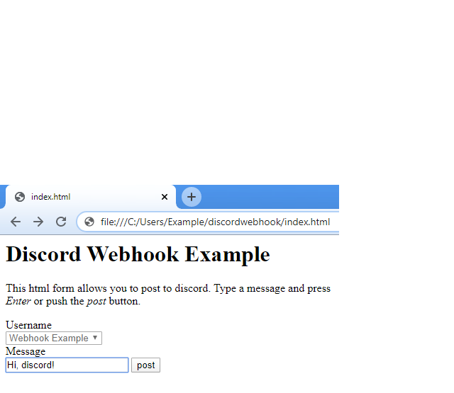
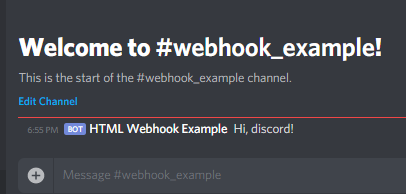

discordwebhook
==============
An example of using a Discord webhook with a basic HTML form.

Type your message in your html file: 

See your message in discord:  

Who
---
This example is meant for anyone who wants to practice basic HTML.  It uses an HTML form to send a message in a discord channel, so it's also useful for anyone who wants that to happen in their discord server.

What
----
Following this example requires only two things:
1. A discord server with channel that has a webhook.  Check out [that, help is available in this github repository's wiki.
2. A text editor.  This example uses a single html file to send data to discord, and it is easy to edit with any program that allows typing.  The content may be incorporated into a much more complicated website, but that is beyond the scope of this example.

How
---
To follow this example step by step, start with the wiki page [Post your first message](https://github.com/sethbattin/discordwebhook/wiki/Post-Your-First-Message).  To read the complete example, see [the html file](index.html).

